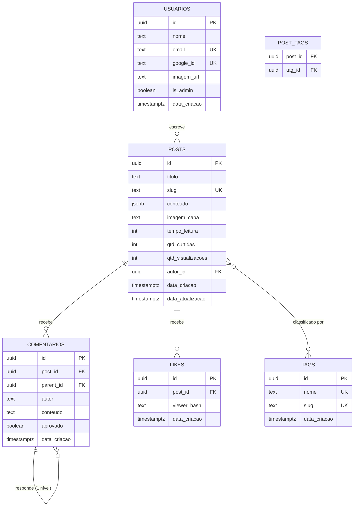

# Architecture Document — Pensa Comigo

> **A fé que te obriga a pensar.**
> Blog cristão de meditações reflexivas, com editor de conteúdo em blocos, comentários, curtidas e contagem de visualizações.

---

## 1. Executive Summary

**Pensa Comigo** é uma aplicação de blog autoral focada em publicar meditações cristãs em formato reflexivo. O conteúdo é montado a partir de um editor de blocos (texto rich-text, imagem e link), com reordenação por arrastar-e-soltar. A plataforma suporta múltiplos autores administradores (inicialmente Antonio Ramon e Jéssica Rose, com expansão prevista), e os leitores podem comentar, curtir e contribuir para a contagem de visualizações.

O backend adota **Clean Architecture + CQRS + Vertical Slicing** sobre **.NET 10 (LTS)**, espelhando o padrão arquitetural já consolidado em projetos anteriores, modernizado para a versão LTS mais recente. A persistência usa **PostgreSQL gerenciado pelo Supabase**, e o armazenamento de imagens usa o **Supabase Storage**.

---

## 2. Technology Stack

| Camada | Tecnologia | Observação |
| :--- | :--- | :--- |
| **Runtime/Linguagem** | .NET 10 (LTS) / C# | Suporte até nov/2028 |
| **Arquitetura** | Clean Architecture + CQRS + Vertical Slicing | Organização por casos de uso |
| **Mediação** | MediatR | Despacho de Commands/Queries |
| **ORM** | Entity Framework Core (Npgsql) | Mapeamento para PostgreSQL |
| **Validação** | FluentValidation | Via pipeline behavior do MediatR |
| **Listagem/Paginação** | Gridify | Filtro/ordenação/paginação dinâmicos via querystring; padrão de todo endpoint de listagem |
| **Banco de Dados** | PostgreSQL (Supabase gerenciado) | `jsonb` nativo para blocos de conteúdo |
| **Storage de Arquivos** | Supabase Storage | Bucket público para leitura, CDN incluso |
| **Autenticação** | Google OAuth (JWT) | Sem armazenamento de senha |
| **Documentação de API** | OpenAPI + Swagger UI | Exposição automática dos endpoints |
| **Frontend** | Angular + Angular Material | Fora do escopo deste documento |

---

## 3. Architecture Patterns

### 3.1 Clean Architecture
A solução é dividida em camadas concêntricas, com o domínio no centro e sem dependências de infraestrutura. As dependências apontam sempre para dentro.

- **Domain** — entidades POCO, value objects, interfaces de contrato, enums e regras de domínio. Não depende de nenhuma outra camada.
- **Application** — casos de uso (Commands/Queries + Handlers), orquestração de regras de negócio, validação.
- **Persistence** — implementação de acesso a dados via EF Core, DbContext, configurations, migrations e seed.
- **Shared** — integrações transversais (Storage, Auth) e utilitários.
- **Web** — camada de apresentação: controllers magros, middleware, configuração e entry point.

### 3.2 CQRS (Command Query Responsibility Segregation)
Operações de escrita (Commands) e leitura (Queries) são separadas e despachadas via **MediatR**.

- **Commands** encapsulam mutação de estado e regras de negócio (ex.: `CriarPostCommand`).
- **Queries** são otimizadas para recuperação de dados (ex.: `ObterPostPorSlugQuery`).

### 3.3 Vertical Slicing
A camada de aplicação é organizada por **caso de uso**, não por tipo de arquivo. Cada caso de uso reúne em uma única pasta isolada o seu Command/Query, Handler, Validator e Response. Isso reduz a navegação entre pastas e mantém coeso tudo o que pertence a uma funcionalidade.

### 3.4 Fluxo de uma Requisição
1. O **Controller** recebe o DTO e o converte em Command/Query.
2. O **MediatR** despacha para o Handler correspondente.
3. Um **pipeline behavior** executa o Validator (FluentValidation) antes do Handler.
4. O **Handler** aplica a lógica (ex.: gera slug, calcula tempo de leitura), persiste via EF Core e retorna um Response.
5. O **Controller** devolve um `IResult` com o status apropriado.

---

## 4. Solution Structure

```
PensaComigo/
├── src/
│   ├── PensaComigo.Domain/
│   │   ├── Entities/         # Usuario, Post, Tag, Comentario, Like
│   │   ├── ValueObjects/     # Bloco (conteúdo do post)
│   │   ├── Interfaces/       # contratos de repositório/serviço
│   │   └── Enums/            # TipoBloco (Texto, Imagem, Link)
│   │
│   ├── PensaComigo.Application/
│   │   ├── UseCases/         # Vertical Slicing por caso de uso
│   │   │   ├── Posts/        # CriarPost, AtualizarPost, ListarPosts, ObterPostPorSlug, DeletarPost
│   │   │   ├── Comentarios/  # CriarComentario, ResponderComentario, AprovarComentario, ListarComentariosPorPost
│   │   │   ├── Likes/        # CurtirPost, DescurtirPost
│   │   │   ├── Tags/         # CriarTag, ListarTags
│   │   │   └── Usuarios/     # ObterPerfil
│   │   ├── Common/
│   │   │   ├── Behaviors/    # pipeline MediatR (validação, logging)
│   │   │   └── Interfaces/
│   │   └── DependencyInjection.cs
│   │
│   ├── PensaComigo.Persistence/
│   │   ├── Context/          # PensaComigoDbContext
│   │   ├── Configurations/   # EntityTypeConfiguration por entidade
│   │   ├── Migrations/
│   │   ├── Repositories/
│   │   ├── Seed/             # UsuariosSeed (Antonio e Jéssica)
│   │   └── DependencyInjection.cs
│   │
│   ├── PensaComigo.Shared/
│   │   ├── Storage/          # integração Supabase Storage
│   │   ├── Auth/             # validação de token Google
│   │   └── Utils/            # CalculadorTempoLeitura
│   │
│   └── PensaComigo.Web/
│       ├── Controllers/      # PostsController, ComentariosController, LikesController, TagsController, AuthController
│       ├── Middleware/
│       ├── Program.cs        # entry point + Swagger
│       └── appsettings.json
│
└── tests/
    ├── PensaComigo.UnitTests/        # Handlers, Validators, regras de domínio
    └── PensaComigo.IntegrationTests/ # fluxos ponta a ponta
```

---

## 5. Data Architecture

### 5.1 Padrões de Dados
- **Banco:** PostgreSQL (Supabase gerenciado)
- **ORM:** Entity Framework Core (provider Npgsql)
- **Conteúdo de post:** armazenado como `jsonb` (array de blocos heterogêneos) via **conversor manual** do EF (`HasConversion` + `JsonSerializer`) — a lista é serializada/desserializada inteira, tratada como blob. Sem índice GIN (não há consulta por dentro dos blocos).
- **Contadores:** `qtd_curtidas` e `qtd_visualizacoes` são desnormalizados na tabela `posts` para leitura rápida sem `COUNT`.
- **Conexão:** SSL obrigatório. Conexão direta (porta 5432) para migrations; pooled (Supavisor, porta 6543) para runtime.

### 5.2 Entidades

#### Usuário
Autores administradores. Autenticação via Google OAuth — **sem armazenamento de senha**. Antonio Ramon e Jéssica Rose são criados via seed; `google_id` e `imagem_url` (foto da conta Google) são preenchidos no primeiro login.

**Fluxo de login:** o frontend (Angular) executa o Google OAuth e envia o token do Google ao backend; o backend **valida a assinatura** do token, localiza o usuário **já existente** pelo email e emite um **JWT próprio**. Todo endpoint protegido usa esse JWT.

**Autorização:** apenas usuários do seed são admins. Login de um email fora do seed é **recusado** — o backend não cria usuário automaticamente (`is_admin` default `false`). Novos autores entram via seed/migration. Leitores comentam e curtem **sem conta**.

#### Post
Unidade central de conteúdo. O campo `conteudo` (`jsonb`) guarda o array de blocos (texto rich-text, imagem ou link). Inclui contadores desnormalizados de curtidas e visualizações, e `tempo_leitura` calculado pelo backend ao salvar.

#### Tag
Entidade própria, relacionada a posts em N:N através da tabela de junção `post_tags`.

#### Comentário
Suporta **um único nível de resposta**. Um comentário raiz tem `parent_id = null`; uma resposta referencia o comentário raiz. A proibição de "resposta de resposta" é uma **regra de negócio** garantida no Handler/Validator, não uma restrição de esquema.

**Moderação automática (estilo YouTube), sem aprovação manual prévia:**
- **Rate limit:** máx. 5 comentários por `viewer_hash` em janela deslizante de 1 min. Estouro → HTTP 429. Estado em cache de memória (sem tabela; upgrade pra Redis se escalar).
- **Filtro de palavrão:** lista de termos proibidos (config no Shared). Match → comentário **bloqueado** com erro de validação ("revise seu comentário"). Nada sujo entra no banco.
- Comentário que passa nos dois filtros é **publicado na hora** (`aprovado = true`).
- Flag `aprovado` é usada pelo admin apenas para **esconder** manualmente um comentário publicado; admin também pode deletar qualquer um.

#### Like
Curtida com deduplicação por `viewer_hash` (hash do visitante), com constraint de unicidade `(post_id, viewer_hash)` para impedir múltiplas curtidas do mesmo visitante.

> **Visualizações:** tratadas de forma simplificada — apenas a coluna `qtd_visualizacoes` na tabela `posts`, **incrementada crua a cada acesso, sem proteção contra refresh**. Não há tabela dedicada de views. Upgrade para dedup por cache marcado no código com comentário `ponytail:` caso o número precise ser preciso.

### 5.3 Diagrama de Entidades



### 5.4 Schema SQL

```sql
-- USUÁRIOS — login via Google OAuth, sem senha
create table usuarios (
    id           uuid primary key default gen_random_uuid(),
    nome         text not null,
    email        text not null unique,
    google_id    text unique,
    imagem_url   text not null,
    is_admin     boolean not null default false,
    data_criacao timestamptz not null default now()
);

-- POSTS
create table posts (
    id                uuid primary key default gen_random_uuid(),
    titulo            text not null,
    slug              text not null unique,
    conteudo          jsonb not null default '[]',
    imagem_capa       text not null,
    tempo_leitura     integer not null default 0,
    qtd_curtidas      integer not null default 0,
    qtd_visualizacoes integer not null default 0,
    autor_id          uuid not null references usuarios(id),
    data_criacao      timestamptz not null default now(),
    data_atualizacao  timestamptz not null default now()
);

create unique index idx_posts_slug on posts(slug);
create index idx_posts_data on posts(data_criacao desc);
-- Índice GIN removido: conteúdo (blocos) é lido inteiro, nunca consultado por dentro.
-- Adicionar apenas se surgir busca full-text dentro dos blocos.

-- TAGS
create table tags (
    id           uuid primary key default gen_random_uuid(),
    nome         text not null unique,
    slug         text not null unique,
    data_criacao timestamptz not null default now()
);

create table post_tags (
    post_id uuid not null references posts(id) on delete cascade,
    tag_id  uuid not null references tags(id)  on delete cascade,
    primary key (post_id, tag_id)
);

create index idx_post_tags_tag on post_tags(tag_id);

-- COMENTÁRIOS — 1 nível de resposta
create table comentarios (
    id           uuid primary key default gen_random_uuid(),
    post_id      uuid not null references posts(id) on delete cascade,
    parent_id    uuid references comentarios(id) on delete cascade,
    autor        text not null,
    conteudo     text not null,
    aprovado     boolean not null default false,
    data_criacao timestamptz not null default now()
);

create index idx_comentarios_post on comentarios(post_id);
create index idx_comentarios_parent on comentarios(parent_id);

-- LIKES — deduplicação por viewer_hash
create table likes (
    id           uuid primary key default gen_random_uuid(),
    post_id      uuid not null references posts(id) on delete cascade,
    viewer_hash  text not null,
    data_criacao timestamptz not null default now(),
    unique (post_id, viewer_hash)
);
```

---

## 6. Modelo de Conteúdo (Blocos)

O campo `conteudo` de cada post é um array de blocos tipados, serializado como `jsonb`. Cada bloco tem um `tipo` que determina seus campos:

| Tipo | Campos | Descrição |
| :--- | :--- | :--- |
| **texto** | `html` ou árvore estruturada | Conteúdo rich-text (negrito, itálico, links, etc.) |
| **imagem** | `path`, `url`, `alt`, `aspectRatio` | Referência à imagem no Supabase Storage (recortada/ajustada no frontend) |
| **link** | `url`, `titulo`, `descricao`, `thumbnail`, `siteName` | Metadados Open Graph capturados de URLs externas |

A ordem dos blocos no array reflete a ordem de exibição, permitindo a reordenação por arrastar-e-soltar no editor.

---

## 7. API Design

API RESTful versionada (`/api/v1`), com controllers magros que apenas orquestram o despacho para os Handlers via MediatR. A documentação é exposta via OpenAPI + Swagger UI, gerada automaticamente a partir dos controllers.

### 7.1 Padrão de Listagem e Paginação (Gridify)

**Todo endpoint de listagem** usa **Gridify** (filtro, ordenação e paginação dinâmicos vindos da querystring) e devolve um **envelope padrão de paginação** — nunca uma lista crua (`[ ... ]`). Espelha o padrão já consolidado no `service-escolaweb`.

- **Query de listagem herda de `GridifyQuery`**, que carrega `Page`, `PageSize`, `OrderBy` e `Filter` (bindados automaticamente da querystring → aparecem sozinhos no Swagger).
- **`Filter` é uma DSL em string** traduzida para SQL (ex.: `Filter=nome=*saude`, `dataCriacao>2026-01-01`). Um **`GridifyMapper` por entidade** faz *whitelist* dos campos filtráveis/ordenáveis — o cliente nunca referencia nome de coluna cru, só os campos expostos.
- **O repositório aplica filtro + ordenação + paginação sobre o `IQueryable`** (no banco, não em memória) via `GridifyQueryableAsync`, que devolve `(TotalItems, Query)` — `TotalItems` é a contagem **antes** de paginar — e materializa em `Pagina<T>`. Sempre define um **`OrderBy` padrão** quando o cliente não manda: sem `ORDER BY` a paginação é instável.
- **Resposta padronizada** no envelope `Pagina<T>` (`Domain/Common/Pagina.cs`) → `{ items: [...], totalItems }`. Todos os endpoints de leitura em lista respondem nesse envelope. Nome em pt-br porque o próprio pacote Gridify já exporta um `Paging<T>` (colisão `CS0104`).
- **Implementação:** pacotes NuGet `Gridify` / `Gridify.EntityFramework` (não a cópia vendorada do `service-escolaweb`; o único patch local relevante lá, `DefaultOrderBy` virtual, vira uma linha no repositório). Config global no `Program.cs`: `EnableEntityFrameworkCompatibilityLayer()` + `IgnoreNotMappedFields = true`.
- **Aplica-se ao projeto inteiro.** Mesmo em lookup pequeno como **Tags** — onde paginar/filtrar é overkill e os parâmetros raramente serão usados — o padrão é mantido pela **consistência**: um único contrato de listagem em toda a API, sem exceções ad-hoc.

### Módulos de Endpoint (visão de alto nível)

| Módulo | Responsabilidade |
| :--- | :--- |
| **Auth** | Login via Google OAuth, emissão/renovação de token |
| **Posts** | CRUD de posts, listagem, busca por slug |
| **Comentários** | Criação, resposta (1 nível), moderação, listagem por post |
| **Likes** | Curtir/descurtir post |
| **Tags** | Criação e listagem de tags |
| **Usuários** | Obtenção de perfil |

---

## 8. Decisões de Design Registradas

| # | Decisão | Justificativa |
| :--- | :--- | :--- |
| 1 | PostgreSQL em vez de MySQL | `jsonb` nativo com indexação GIN, ideal para os blocos de conteúdo |
| 2 | Supabase como banco + storage (Caminho A) | Infra gerenciada, rápido para iniciar; auth fica a cargo do .NET |
| 3 | Sem campo de senha | Autenticação 100% via Google OAuth |
| 4 | Contadores desnormalizados | Leitura rápida de curtidas/visualizações sem `COUNT` |
| 5 | Views sem tabela dedicada | Simplicidade: incremento direto na coluna `qtd_visualizacoes` |
| 6 | Likes com tabela e `viewer_hash` | Impedir curtidas duplicadas do mesmo visitante |
| 7 | Comentários com 1 nível | Limite garantido por regra de negócio, não por esquema |
| 8 | Blocos em `jsonb` | Flexibilidade para tipos heterogêneos sem alterar esquema |
| 9 | Repository pattern mantido, um repo por raiz de agregado (Post, Comentario, Usuario, Tag) | Encapsula queries com `Include`/projeção; combina com Vertical Slicing. Sem repo para Like/PostTag |
| 10 | Bloco = modelo *flat* + conversor manual `jsonb` (não complex type) | Post é lido inteiro; blob JSON é simples e previsível. Sem índice GIN |
| 11 | Login: frontend faz Google, backend valida e emite JWT próprio | Padrão SPA + API; backend não redireciona nem guarda sessão |
| 12 | Só seed é admin; login externo recusado; `is_admin` default `false` | Leitor não precisa de conta; evita admin acidental |
| 13 | Slug gerado do título na criação e **congelado**; sufixo `-N` na colisão | Link estável mesmo se o título for editado |
| 14 | Upload de imagem via **signed URL** (frontend sobe direto no Supabase) | Binário não passa pelo .NET |
| 15 | Moderação de comentário automática: rate limit 5/min + filtro de palavrão que **bloqueia** | Estilo YouTube, sem gargalo de aprovação manual |
| 16 | Erros de domínio via **exceções** + `ExceptionHandlingMiddleware` | Reusa o middleware do FluentValidation; controllers magros |
| 17 | Testes de integração com **Testcontainers** (Postgres real) | Valida `jsonb` e constraints reais; InMemory testaria ficção |
| 18 | Pipeline MediatR: Validation + Logging + **UnitOfWork** (commit atômico nos Commands) | Garante Like + contador desnormalizado na mesma transação |
| 19 | **Gridify** como padrão de listagem em **todo o projeto**; Query herda `GridifyQuery`, resposta no envelope `Pagina<T>` (`{ items, totalItems }`) | Contrato único de listagem (filtro/ordenação/paginação dinâmicos) em toda a API, espelhando o `service-escolaweb`. Mantido mesmo onde é overkill (Tags) pela consistência; ver §7.1 |

---

## 9. Testing Strategy

- **Testes Unitários** — validação de Handlers, Validators e regras de domínio (ex.: limite de 1 nível de comentário, cálculo de tempo de leitura).
- **Testes de Integração** — fluxos ponta a ponta envolvendo persistência e infraestrutura.

---

## 10. Pontos em Aberto

Todos os pontos anteriormente em aberto foram resolvidos no grilling de arquitetura (ver Decisões #9–18):

- ~~Incremento de visualizações~~ → cru, sem proteção (Decisão #7/entidade); upgrade marcado com `ponytail:`.
- ~~Upload Supabase Storage~~ → signed URL, frontend sobe direto (Decisão #14).
- ~~Modelo de blocos + mapeamento jsonb~~ → flat + conversor manual, sem GIN (Decisão #10).
- ~~Geração de slug~~ → do título na criação, congelado, sufixo `-N` (Decisão #13).

Restam apenas detalhes idiomáticos resolvidos na implementação com o padrão .NET: versionamento `/api/v1` via atributo de rota e retorno `ActionResult<T>` nos controllers.
